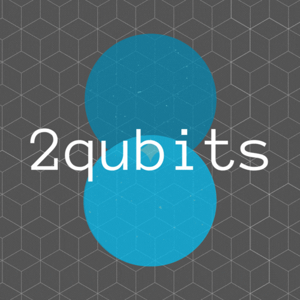
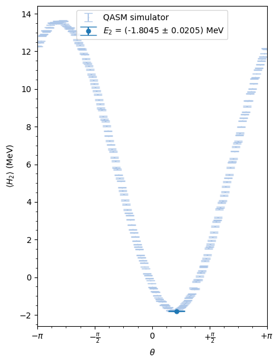
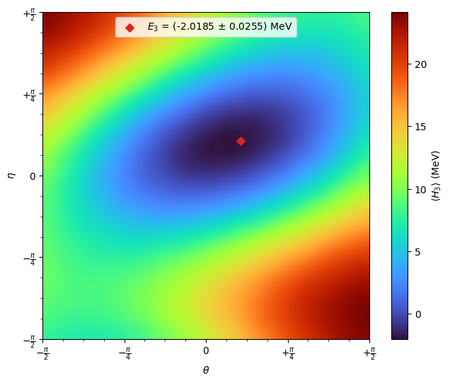
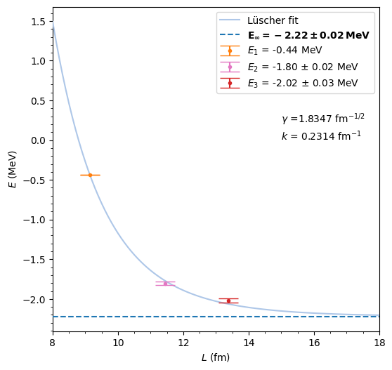
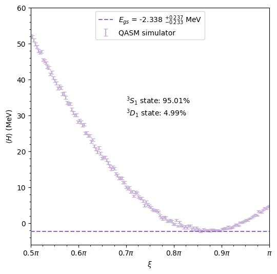

[comment]: <>
# 2qubits

## About
Implementation of a Python simulation of a quantum system of a few qubits. A variational estimate of the ground state energy of the deuteron is simulated on a Qiskit quantum circuit. This is done in two different ways, one being the representation of each quantum harmonic oscillator state the nucleus can occupy as a qubit, the other being the relative mixing between singlet and triplet spin and isospin states of the system mapped into a quantum circuit. Secondly, some read-out error mitigation algorithms are implemented.

The present work is done in collaboration with [TIFPA (Trento Institute for Fundamental Physics and Applications)](https://www.tifpa.infn.it/) research centre and the [University of Trento](https://www.unitn.it/en) as part of a quantum computing internship.

## Deuteron: the deuterium nucleus
The deuteron is the bound state of a proton and a neutron. In order to estimate the binding energy of the system, there are two main approaches one could follow involving a simulation on a quantum computer.

### EFT Hamiltonian
The first being the one mapping the creation and destruction operators of the deuteron into combinations of Pauli gates. The ladder operators $a_n^\dagger$ and $a_n$ create and annihilate a deuteron in the harmonic oscillator state $|n \rangle$. The Hamiltonian (from pionless effective field theory) is of the form

$$
H_N = \sum_{n,n'=0}^{N-1} \langle n' | T+V | n \rangle \\,a_{n'}^\dagger a_n.
$$

Thanks to the Jordan-Wigner transformation, the Hamiltonian is expressed in terms of Pauli matrices, allowing us to map it into a quantum circuit with $N$ qubits. By calculating the variational ground state energies for $H_1$, $H_2$ and $H_3$, one can extrapolate the infinite-basis binding energy using the harmonic oscillator variant of Lüscher formula.

### Relative mixing between $^3 S_1$ and $^3 D_1$ partial waves
The second being the study of the relative mixing between the only two allowed states for the ground state deuteron: a isospin singlet, spin triplet state with $L=0$ ($^3 S_1$) and $L=2$ ($^3 D_1$). One can consider the two-level system built from the $S$ wave $\ket{\phi_S}$ and $D$ wave $\ket{\phi_D}$ such that the Hamiltonian is of the form:

$$
H = \left(\begin{matrix} 
    \braket{\phi_S|H|\phi_S} & \braket{\phi_S|H|\phi_D} \\ 
    \braket{\phi_D|H|\phi_S} & \braket{\phi_D|H|\phi_D}\end{matrix}\right).
$$

By introducing a relative mixing angle $\xi$, one can calculate the optimal mixing between the two partial waves in order to obtain the lowest energy:

$$
\ket{\psi(\xi)} = \sin\left(\frac{\xi}{2}\right)\ket{\phi_S} + \cos\left(\frac{\xi}{2}\right) \ket{\phi_D}.
$$

## How to run
The code is a simple Jupyter notebook running Python. All you need to do is to make sure you installed the Python and Qiskit libraries contained in the first block of code of the file `deuteron.ipynb`. Make sure you run the blocks in order, since in some cases comparisons between previous and new results are performed.

## Results
Here you can find an example of some results obtained with the code in `deuteron.ipynb`:

     
&nbsp; &nbsp; &nbsp; &nbsp;
     
&nbsp; &nbsp; &nbsp; &nbsp;
     
&nbsp; &nbsp; &nbsp; &nbsp;
     
&nbsp; &nbsp; &nbsp; &nbsp;
     

## References
The EFT approach is mostly taken from the work presented [here](https://arxiv.org/abs/1801.03897).
The relative mixing Hamiltonian can be found [here](https://arxiv.org/abs/1905.08383) instead.
Read-out error correction procedures and rigorous confidence intervals estimates are explained in the appendices [here](https://arxiv.org/abs/2102.12556) and [here](https://arxiv.org/abs/2009.13485).

## Acknowledgements
- [A. Roggero](https://scholar.google.it/citations?user=_gXM9vEAAAAJ&hl=it) (professor and internship tutor)
- [Diego Scantamburlo](https://github.com/diegoscantam)

## License
The code here presented is released under version 3 of the [GNU General Public License](https://www.gnu.org/licenses/gpl-3.0.html).
